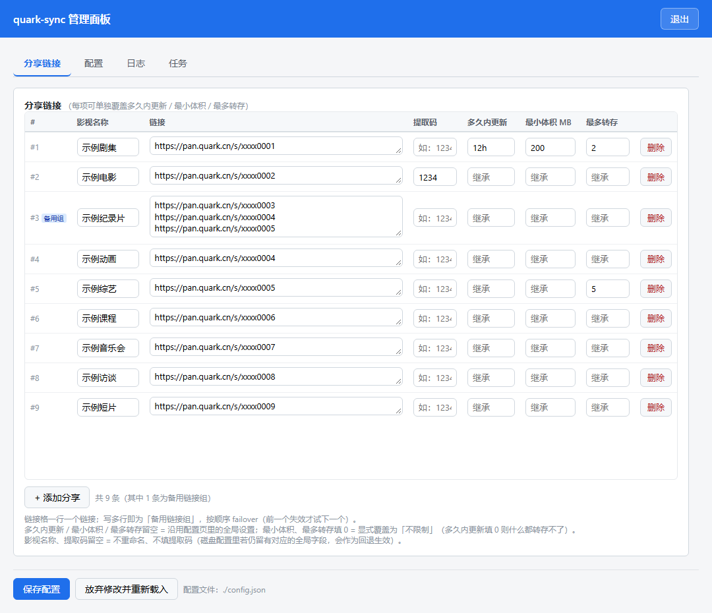

# quark-sync

自动把夸克网盘分享链接里**最近更新**的文件转存到自己的网盘，支持定时同步、下载到本地、以及从 AList 下载。（注：本项目完全使用 DeepSeek V4 Pro 生成。）



*「分享链接」页：一行一个分享，链接格写多行即为「备用链接组」；每个分享可单独设置影视名称与提取码，并覆盖多久内更新 / 最小体积 / 最多转存。*

## 功能

- **自动转存** — 监控多个分享链接，把最近更新的文件转存到自己的网盘，自动去重
- **精细筛选** — 每个分享可单独设置多久内更新、最小体积、最多转存几个
- **网页管理界面** — 浏览器里维护配置、看日志、手动触发任务，改完即时生效无需重启
- **重命名与去重** — 可给转存的文件加前缀；同名集数的多个画质版本只保留最高清的那份
- **定时调度** — cron 定时执行；同步跑完可紧接着下载，不用猜间隔
- **下载到本地** — 夸克网盘与 AList 两种来源，带完整性校验；可下载后删除云端文件

## 快速开始

### 1. 安装

```bash
git clone <repo-url>
cd quark-sync
npm install
```

### 2. 获取 Cookie

浏览器打开 [pan.quark.cn](https://pan.quark.cn) 登录，按 `F12` → `Application` → `Cookies`，复制完整 Cookie 字符串。

### 3. 写配置

```bash
cp docs/config.example.json config.json
```

最小可用配置（完整字段见下方表格）：

```json
{
  "cookie": "刚复制的 Cookie",
  "webToken": "至少 8 位、只有你知道的随机字符串",
  "hours": 24,
  "shareUrls": [
    { "url": "https://pan.quark.cn/s/xxxxxxxx", "password": "提取码", "tip": "遮天-" }
  ]
}
```

### 4. 启动

```bash
npm run web      # 网页界面 + 定时任务（推荐）
```

然后浏览器访问 `http://<主机IP>:3000`，输入 `webToken` 登录。`webToken` 至少要 8 位，没设置的话 `web` 模式会**拒绝启动** —— 配置里含等同账号密码的 Cookie，不能无鉴权暴露出去。

其他运行方式：

| 模式 | 命令 | 说明 |
| --- | --- | --- |
| 网页界面 + 定时任务 | `npm run web` | 推荐；同进程跑 HTTP 界面与 cron |
| 单次同步 | `npm run sync` | 检查所有分享、转存新文件后退出 |
| 试运行同步 | `npm run sync-dry` | 只列出会转存哪些文件，不做任何写入 |
| 单次下载 | `npm run download` | 把网盘目标文件夹下载到本地 |
| AList 下载 | `npm run alist` | 从 AList 服务器下载到本地 |
| 只跑定时任务 | `npm run schedule` | 不带网页界面 |
| 强制重新下载 | `npm run download-force`、`npm run alist-force` | 忽略已下载记录 |

## 配置项

平时在网页的「配置」页里改最省事；下面是手改 `config.json` 时的字段表。

| 字段 | 类型 | 说明 |
| --- | --- | --- |
| `cookie` | string | **必填**，夸克网盘的完整 Cookie |
| `shareUrls` | array | **必填**，分享列表。每项可写成链接字符串，或 `{ url, password, tip, hours, minFileSizeMB, maxFilesPerShare }`；`url` 写成数组即为备用链接组（按序 failover） |
| `shareUrl` | string | 单个分享链接（与 `shareUrls` 二选一） |
| `password` | string | 默认提取码；建议直接写在每个分享里 |
| `tip` | string | 默认文件名前缀；建议直接写在每个分享里 |
| `hours` | int/string | 只转存最近这段时间内更新过的文件，默认 48 小时。支持 `30m`、`12h`、`1d`、`1w`、`1mo`、`1y`，也可直接填数字（按小时） |
| `days` | int | `hours` 的天数写法（历史字段） |
| `minFileSizeMB` | int | 小于这个体积（MB）的文件不转存，默认 0 不过滤 |
| `maxFilesPerShare` | int | 每个分享最多转存几个文件（按更新时间取最新的），默认 0 不限制 |
| `targetDirName` | string | 转存目标文件夹；支持多级路径如 `转存/来自：分享`（不存在的层级会自动创建）。不填则转存到**网盘根目录** |
| `targetDirFid` | string | 目标文件夹 ID，优先级高于 `targetDirName`；高级选项，需手改配置 |
| `downloadDir` | string | 本地下载目录 |
| `deleteAfterDownload` | bool | 下载成功后删除云端文件，默认 false |
| `cleanupAfterDays` | int | 定时任务触发时清理 N 天前的文件（云端 + 本地）；0 或不填都不清理 |
| `alistUrl` | string | AList 服务器地址 |
| `alistToken` | string | AList 认证 Token |
| `alistPath` | string | 从 AList 下载的**源目录**，其中的文件会下载到 `downloadDir`；默认 `/kuake/来自：分享` |
| `alistRefresh` | bool | 列目录时绕过 AList 缓存（需管理员权限） |
| `syncCron` | string/array | 同步任务的 cron 表达式，数组即多个时间点 |
| `alistCron` | string/array | AList 下载任务的 cron 表达式；开了 `downloadAfterSync` 后通常留空 |
| `downloadAfterSync` | bool | 同步跑完紧接着执行 AList 下载（仅定时任务） |
| `pollInterval` | int | 任务轮询间隔（毫秒），默认 1000 |
| `pruneDeadShares` | bool | 任务执行后自动移除确定失效的分享链接，默认 false（仅报告） |
| `webPort` | int | 网页监听端口，默认 3000 |
| `webHost` | string | 网页监听地址，默认 `0.0.0.0`（局域网可访问）；设 `127.0.0.1` 则仅本机 |
| `webToken` | string | 网页登录 Token，至少 8 位；`web` 模式下留空会直接拒绝启动（其他模式用不到） |
| `runOnStartup` | bool | `web` 模式启动后先跑一次同步与下载，默认 true |

取值语义与边界（`0` 到底是什么意思、非法值怎么回退、多级路径的规则等）见 **[docs/details.md](docs/details.md)**。

## 网页管理界面

| 页面 | 作用 |
| --- | --- |
| **分享链接**（默认页） | 表格化维护分享；一行一个，链接格写多行即为「备用链接组」；每项可单独设置影视名称与筛选条件，顶部可按名称或链接筛选 |
| **配置** | 表单化编辑其余配置项，保存后**定时任务自动重载，无需重启** |
| **日志** | 按级别与关键字过滤，可调行数、可自动刷新；日志很大也不卡 |
| **任务** | 查看各 cron 任务的状态与**下次运行时间**，可立即手动执行同步 / 下载，也可以先「试运行同步」预览会转存哪些文件 |

三点需要知道：

- **Cookie 不回显** — 页面只显示 `sk-a****wxyz` 这样的掩码，完整 Cookie 不会下发到浏览器
- **默认监听 `0.0.0.0`** — 局域网可访问；Docker 的端口映射会绕过这层保护，**鉴权是唯一防线**，请把 `webToken` 设得足够复杂
- **任务互斥** — 同步与下载同一时间只允许一个运行，定时触发与网页手动触发共用同一把锁

## Docker 部署

```bash
docker compose up -d
```

`docker-compose.yml` 已映射 `3000:3000` 并设置 `TZ=Asia/Shanghai`，容器默认以 `web` 模式启动。首次启动若 `config/config.json` 不存在会从模板自动生成，填好 `cookie` 与 `webToken` 后重启容器即可。

## 注意事项

- **`m` 是分钟，月请写 `mo`** — `30m` 是 30 分钟，`30mo` 才是 30 个月
- **筛选条件写 `0` 是显式覆盖** — `minFileSizeMB` / `maxFilesPerShare` 写 0 表示不限制（会覆盖全局值）；而 `hours` 写 0 是「什么都转存不了」，通常不是你要的
- **去重按「文件名 + 大小」** — 同名但大小不同会被当成另一份内容照常转存；加前缀遇到重名会自动加序号，不会覆盖已有文件
- **下载有完整性校验** — 按实际写入的字节数核对，截断的文件不会被记成已下载，下次自动重下；历史上被截断的文件也会自动修复
- **日志**写在项目根目录的 `sync.log`，按时间顺序追加，自动保留最近 7 天

更多细节（含各类边界与设计取舍的原因）见 **[docs/details.md](docs/details.md)**。

## 发布镜像

先改 `package.json` 的版本号并提交，再发布。

**推荐：GitHub Actions** — 仓库 → Actions → Publish Docker image → Run workflow（或推 `v<版本号>` tag）。首次使用需先配好 `DOCKERHUB_USERNAME` / `DOCKERHUB_TOKEN` 两个 Secret。

**或本地构建推送**：

```bash
npm run docker:build          # linux/amd64 + linux/arm64，推送 latest 与 <版本号>
npm run docker:build:local    # 仅本地构建，用于验证
```

Secret 怎么建、为什么不做成 push 自动发布等说明见 **[docs/details.md](docs/details.md#发布镜像)**。

## 项目结构

| 路径 | 说明 |
| --- | --- |
| `src/index.js` | 核心逻辑：夸克 / AList API 封装、同步、下载、cron 调度、CLI 入口 |
| `src/web.js` | 网页后端：HTTP 服务、鉴权、配置读写、日志与任务接口 |
| `src/ui.html` | 网页前端（零构建，单文件） |
| `docs/` | [细节说明](docs/details.md)、界面截图、`config.example.json` |
| `test/` | 单元测试（`npm test`） |
| `scripts/` | 构建脚本（发布镜像用） |

## 依赖

[axios](https://github.com/axios/axios)（HTTP 客户端）与 [node-cron](https://github.com/node-cron/node-cron)（定时调度）。网页界面基于 Node 内置 `node:http`，测试用 Node 内置的 `node:test`，都不引入额外依赖。

```bash
npm test        # 跑单元测试（时长解析、集数去重、多级路径解析等）
```

## 许可

MIT
